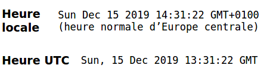
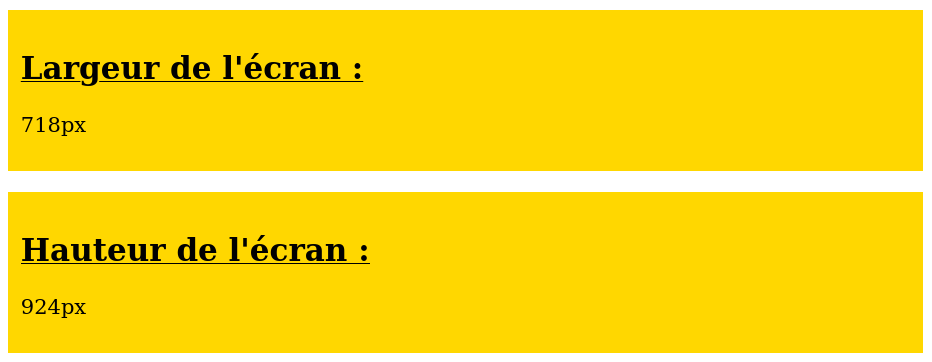
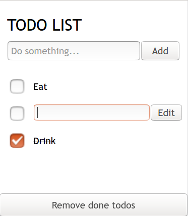

# TP Web Components


## Introduction

Ce TP va nous permettre d'explorer les `Web Components`.

Il est entièrement _vanilla_ : pas de framework CSS ou JS, pas de pré-processeur, pas de bundler... Tout ce que vous découvrirez ici est utilisable nativement dans les navigateurs modernes.

## Partie 0 : Setup

Effectuez un fork de ce repository, clonez ce fork et ouvrez le dossier dans votre IDE.

Aucun installation ici : ouvrez simplement `index.html` (avec l'extension [LiveShare](https://marketplace.visualstudio.com/items?itemName=ritwickdey.LiveServer) de VSCode ou la librairie [http-server](https://www.npmjs.com/package/http-server)).

_Note : je vous déconseille d'ouvrir `index.html` en temps que fichier (`file://...`) car cela pose souvent des problèmes de CORS._

Effectuez un `commit` à la fin de chaque partie.

## Partie 1 : `<current-time>`



Le composant étudié dans cette première partie est déjà écrit dans `src/current-time/current-time.js`. Prenez le temps de l'étudier avant de passer à la suite.

### Importer le JavaScript

Utilisez une balise `<script>` pour importer le fichier `js/current-time.js` dans `index.html`.

Vérifiez dans l'onglet _Network_ de l'inspecteur que le chargement s'effectue sans encombre.

### Déclarer le composant

La classe `CurrentTime` est définie mais il manque la déclaration du composant, c'est à dire l'instruction liant cette classe à un élément nommé `<current-time>`.

À la toute fin du fichier, utilisez l'instruction `customElements.define()` avec les bons paramètres pour déclarer l'élément.

### Utiliser le composant

Vous pouvez à présent utiliser le composant dans le `HTML`.

Ajoutez deux balises : une pour présenter le temps local, une autre pour présenter le temps UTC.

Vérifiez que l'affichage est correct (voir image en début de partie).

### Ajouter les styles CSS

Dans le template du composant, ajoutez une balise `<link>` pour appliquer les styles du fichier `current-time.css`.

Attention, le chemin doit partir de la **racine** du projet (un chemin relatif ne fonctionnera pas).

Vérifiez la bonne application des styles.

## Partie 2 : `<screen-size>`



À vous !

En vous inspirant du composant `current-time`, créez un composant `screen-size` dont le but sera d'afficher la largeur de l'écran. Voici les différentes étapes d'amélioration.

### Largeur instantanée

En insérant la balise `<screen-size></screen-size>` dans le `HTML`, on souhaite voir s'afficher la largeur de l'écran au moment de l'ouverture de la page (non dynamique).

### Largeur dynamique

On souhaite que l'affichage se mette à jour quand on redimensionne la largeur : utilisez pour cela un écouter d'événements `resize` sur `window`.

Pour ne pas trop charger la fonction `constructor()`, prenez l'habitude d'ajouter ce code dans une autre fonction, par exemple `attachEvents()`.

_Bonus : Retirez l'écouter d'évenement lorsque l'élément est détruit, grâce à la méthode `disconnectedCallback()`. Ce [post](https://stackoverflow.com/a/41998194) pourra vous aider._

### Largeur ou hauteur ?

On souhaite maintenant pouvoir ajouter un attribut `dimension` de valeur `width` ou `height` au composant, de cette façon :

```
<screen-size dimension="width"></screen-size>
<screen-size dimension="height"></screen-size>
<screen-size></screen-size>
```

En l'absence de valeur, la largeur est utilisée.

La valeur de l'attribut détermine quelle est la dimension affichée.

### Titre dynamique

Utiliser les `<slots>` pour permettre au composant d'afficher un titre différent selon le `HTML`.

```
<screen-size dimension="width">Largeur de l'écran</screen-size>
<screen-size dimension="height">Hauteur de l'écran</screen-size>
```

### Un coup de peinture

Ajoutez un `<link>` au template du composant pour insérer une feuille de style CSS, et ajoutez quelques styles pour rompre la monotonie de l'apparence par défaut.

### Vérification

Si vous souhaitez une vérification, vous pouvez d'ores et déjà effectuer une _pull request_ de votre _fork_ vers le _repository_ original. Demandez-moi si vous avez besoin d'aide.

Félicitations ! Vous avez créé votre premier `Web Component` !

## Partie 3 : `<todo-app>`



Voici le moment de vérité : recoder l'application _Todo List_ uniquement en Web Components.

Voici quelques astuces pour progresser.

### Composants conseillés

- `todo-app` (chargé dans le `HTML`, la racine de l'application)
  - `todo-new` (formulaire d'ajout)
  - `todo-list`
    - `todo-item`
    - `todo-edit` (formulaire d'édition)

### Composants imbriqués

Il est tout à fait possible d'imbriquer les composants. Ainsi, le template de template de `todo-app` pourrait ressembler à :

```
<h1>Todo App</h1>
<todo-list></todo-list>
```

Attention : il faut pour cela importer la classe `TodoList` dans le fichier `TodoApp` (c'est une dépendance).

### TodosService

Gérez les données grâce à un service, une simple classe dont une instance est exportée :

```
class TodosService {
  constructor() {
    ...
  }
}

const todosService = new TodosService();

export default todosService;
```

Les composants pourront lire, ajouter ou supprimer des todos en important le service :

```
import todosService from '/src/services/todos.service.js';
```

### Générer la liste

Dans `todo-list`, une fois que vous avez la liste des Todos (grâce à `todosService`), vous pourrez générer les `todo-item` :

```
todosService.todos.forEach((todo) => {
  const todoItem = document.createElement('todo-item');
  todoItem.setAttribute('todo-id', todo.id);
  this.itemsEl.appendChild(todoItem);
});
```

Ne passez pas un objet entier en tant qu'attribut de `<todo-item>`. Il faudrait pour cela transformer l'objet en `string`, et inversement, un processus alambiqué.

Passez plutôt l'id de la todo : ainsi `<todo-item>` pourra demander à `todosService` la todo correspondante pour l'afficher.

### Rafraîchir la liste

Votre composant `todo-list` doit se tenir informé des changements pour re-générer la liste dès que nécessaire.

Pour ce faire, `todo-list` demande à `todosService` de stocker une fonction de _callback_, que `todosService` appellera dès que la liste sera modifiée.

Dans la fonction de _callback_, videz la liste grâce à `innerHTML = ''`, puis générez la nouvelle liste.

### Bonne chance !

Une fois votre travail effectué, vous pouvez le soumettre par pull request pour solliciter une correction personnalisée.
